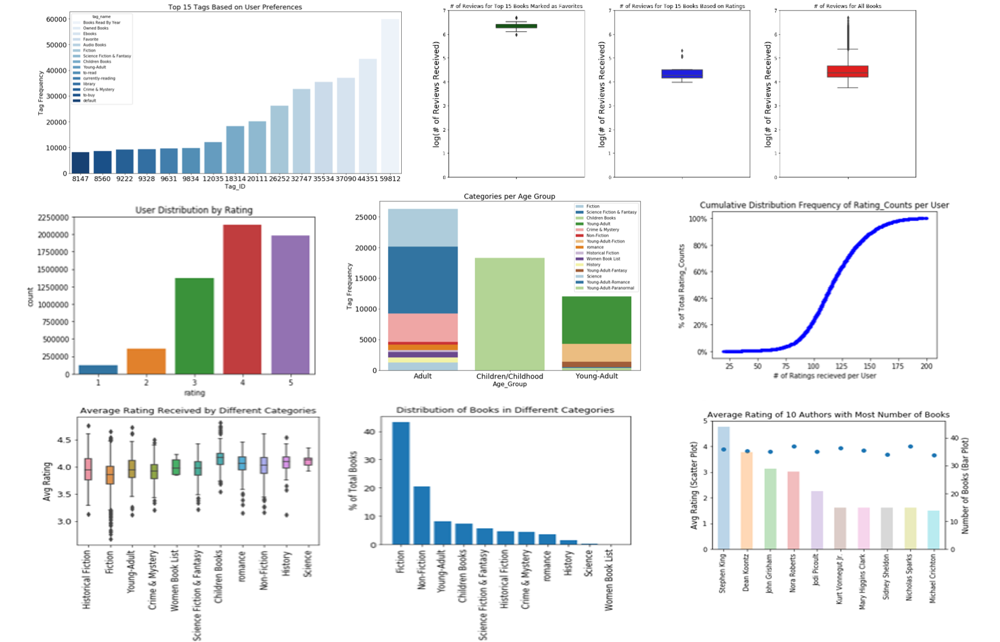
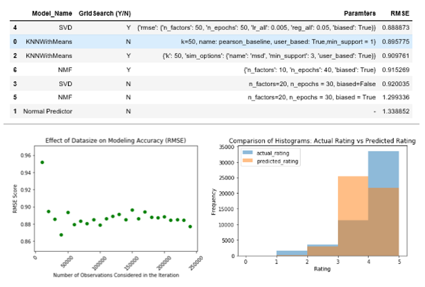
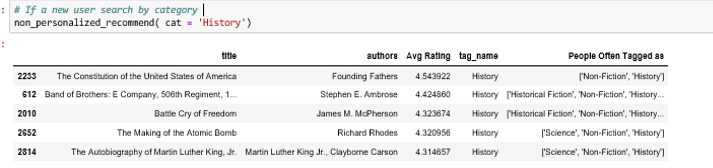
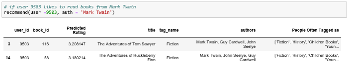
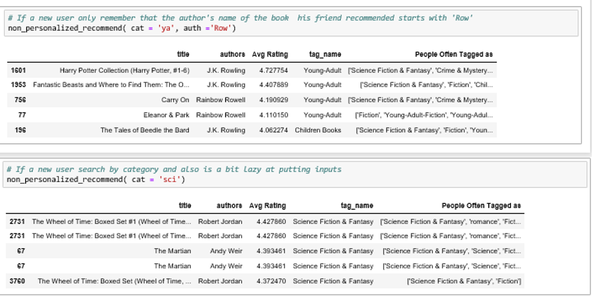

# Collaborative Filtering Based Book Recommendation Engine

# Introduction

Recommendation engines have laid the foundation of every major tech company around us that provides retail, video-on-demand or music streaming service and thus redefined the way we shop, search for an old friend, find new music or places to go to. From finding the best product in the market to searching for an old friend online or listening to songs while driving, recommender systems are everywhere. A recommender system helps to filter vast amount of information from all users and item database to individual’s preference.  For example, Amazon uses it to suggest products to customers, and Spotify uses it to decide which song to play next for a user. 

Book reading apps like Goodreads has personally helped me to find books I couldn’t put away and thus getting back to the habit of reading regularly again. While a lot of datasets for movies (Netflix, Movielens) or songs have been explored previously to understand how recommendation engine works for those applications and what are the scopes of future improvement, book recommendation engines have been relatively less explored.

The primary goal of this project is to develop a collaborative book recommendation model using goodreads dataset that can suggest readers what books to read next. Additionally, data wrangling and exploratory data analysis will be utilized to draw insights about users reading preferences (e.g. how they like to tag, what ratings they usually provide etc.)  and current trends in the book market (book categories  that are in demand,  successful authors in the market etc.). 

# Key Development Goals

The recommendation system should have the following capabilities  

1. For new or anonymous users, the recommendation engine can make base-case recommendations based on the past ratings and/or   other keywords.  

2. With user ID as input and user’s search preferences, the collaborative filtering can make personalized recommendations to an active user based on his/her activity history and search preferences.  

3. The search engine have smart filterning capabiliy and can provide built in tag-recommendations\suggestions to further refine the search

# Dataset

The goodreads dataset for this project is available on Kaggle.  A link to the original dataset is given below this section.

***ratings.csv*** contains user_ids, book_ids and ratings. It has 6,000,000 observations.

***books.csv*** has metadata for each book (goodreads IDs, authors, title, average rating, etc.). The raw dataset has 23 columns and 10,000 entries.

***book_tags.csv***contains tags/shelves/genres assigned by users to books. Tags in this file are represented by their IDs. The file has 999912 observations

***tags.csv*** translates tag IDs to names. The file contains 34252 observations

***to_read.csv*** provides IDs of the books marked "to read" by each user, as user_id,book_id pairs.

Link to the preliminary dataset:
https://github.com/zygmuntz/goodbooks-10k.

# Solution Approach

The overall project is organized in the following framework. Please note that elaborate explanation of each step  can be found in separate notebook corresponding to each step. 

> **1. Data Wrangling:**  [(Link to Notebook)](https://github.com/shamafarabi/Capstone_1_Book_Recommendation/blob/master/Data%20Wrangling.ipynb)

The first step in this process was to quickly inspect all the datasets, identify how they are connected to each other and then perform data wrangling (i.e. identify duplicates, missing values, non -english titles or tag_names, merge diferent datasets to extract meaningful information) so that we can have tidy datasets for exploratory data analysis and modeling. A key step in the data wrangling process  was to explore the 34252 different tag_names user have used to tag the books they are interested in, and utlize it to group books into 348 generalized tag names by identifying common patterns in the user provided tag names. For example, Scinece Fiction and Fantasy were chosen as a generalized tag name for books tagged as 'dark-fantasy','epic-fantasy','fantasy-sci-fi','scifi','scifi-fantasy','sf-fantasy' and many other alternatives.

This step above also allowed to form a database of words or string patterns that the readers may use while searching for a new book. An additional performance metric to evaluate a book was also established by ranking the books based on their tag counts as the reader's favorite book. Once data wrangling is complete, the clean datasets were exported to apply EDA.

> **2. Exploratory Data Analysis:** [(Link to Notebook)](https://github.com/shamafarabi/Capstone_1_Book_Recommendation/blob/master/Exploratory%20Data%20Analysis.ipynb)

In the exploratory data analysis, the goal was to explore the clean datasets and try to understand how factors such as categories, author, year of publication etc. affect the rating of a book. It also helped to look at the other factors that can be considered as a performance metric for differnt books or authors ( e.g. how many reviews a book received, how many books an author published and how their ratings compare etc). The user's preferences in terms of tagging books and rate a book was also explored to better understand what built in features to offer in a book recommendation system (built - in tags) to improve the overall user experience.

> **3. Dataset Size Selection For Modeling:** [(Link to Notebook)](https://github.com/shamafarabi/Capstone_1_Book_Recommendation/blob/master/Use%20of%20%20CDF%20plots%20to%20Filter%20Data.ipynb)

A qucik inspection of The ratings.csv dataset showed that the dataset has 6,000,000 observations. As modeling with such a large number of observation is computatinally challenging,  it was important to identify  active users (i.e. users who read and rate frequetntly) and books receiving siginficant reviews for modeling. This allowed to siginificantly reduce computational time and complexity required for modeling while retaining all the necessary information and patterns in the dataset. The cutoff points for users and books were identified by analyzing the CDF plots of number of review per user and number of reviews per book as the plots helped to identify where the information in the dataset and size of the dataset is balanced. 

Next, modeling is performed on different subsets of the truncated dataset while increasing the size of the dataset in each step. The modeling accuracy (RMSE) is then calculated for each size to understand if there is a benifit of including more or less observations in terms of modeling accuracy. This step helps to identify the size of the final dataset that is to be used for modeling.

> **4. Machine Learning (ML) Modeling and Optimization:** [(Link to Notebook)](https://github.com/shamafarabi/Capstone_1_Book_Recommendation/blob/master/MLModeling_Collaborative%20Filtering%20.ipynb)

In this step, the user's rating history was divided into train and test dataset. The idea is to create a scenario where the train data respresents the book the users have read and rated, and the test data contains books that can be recommendeded to the user in the future.Different collaborative filtering based algorithms (i.e.KNN, SVD or Matrix Factorization) were then fit to the train dataset. To be able to evaluate how the model will perform on unseen data, RMSE score was calculated for each model by utilizing cross validation method. The performance was compared with a baseline ML model to estimate if ML modeling can improve the precition accuracy. A hyperparamter optimization was then performed for each model to further improve the efficiency of the model. The best performing model was then used on the test dataset to predict user's ratings for books in the test dataset.

> **5. Non Personalized and Personalized Recommendation System:** [(Link to Notebook)](https://github.com/shamafarabi/Capstone_1_Book_Recommendation/blob/master/Implementation%20of%20Recommendation%20System.ipynb)

Data Wrangling and EDA allowed to orgnaize the books under different popular categories based on their tag_counts and tag_names by different users. It also helped us to develop a database of .csv filesto aid keyword based search, recommend tags to refine search or shelve books as well as compute and combine all the relevant information about each book. 

In this final step of the project, the non Personalized recommendation system is implemented by utlizing this book based database to recommend books to a new user once the user specifies any of his preferences (categories, authors, number of books to search etc.). The books in the search results is sorted by the average of ratings received in the past, and the top n results are shown. On the contrary, the personalized recommendation system shows customized search results for a particular user where the books are sorted by the ratings that the user is to give per prediction of the ML model. 

# Summary of Key Findings

> **Understanding User Behavior** 

- When the tag counts of different generalized tag_names were ranked, the top 10 tag name shows that users prefer to have separate shelves for books they marked as favorite, read in a particular year (e.g. read in 1990, Childhood Books), owned or borrowed from library, read in a different format (e.g. ebook\ audiobook). The other shelving preferance per the top 10 tag_names were different book categories such as 'Fiction', 'Young - Adult' etc.

- The count plot of user provided ratings shows that users are more likely to rate a book 4 or higher. As the tag counts for books they mark as favorite is also higher (shown previosuly), it seems that users are more likely to rate and store a  book when they like it.  

- Users use a wide variety of names even if they are tagging a book in the same category. For example, books relevant to Science Fiction and Fantasy was stored as dark-fantasy','epic-fantasy','fantasy-sci-fi','fantasy-science-fiction','sci-fi','sci-fi-and-fantasy','sf-fantasy' and many other similar alternatives.

> **Factors to Consider for a Book's Rating**

- EDA shows that the top 15 books per tag_count as reader's favorite is not same as the top 15 books ranked per ratings of the users. Also, while the average rating counts for the top 15 books marked as the reader's favorite is significantly higher (2191465) than the average ratings received by all books (23833),  the avaerage rating counts (18198) for the top 15 books is below the average. Both favorite and  top rated 15 books have higher average ratings (4.26 and 4.74 respectively compared to the average ratings of all books (4.01). These statistics suggest that only considering the average rating  is not enough to rank books for recommendation. An an ideal metric should also consider how many times the book has been marked as favorite and the total number of ratings it received in addition to the average rating of the book.

- 9 of the top 15 favorite books are most frequently tagged in the Young - Adult Category.The other popular categories in the top 15 favorite books are science fiction and fantasy, romance, historical fiction or fiction in general. The harry potter books (ranked 2,3,4,6,7) have also been freqently tagged as children/childhood books. A quick look at the publication date of these books reveal that  most of the books under  Young Adult and Childhood  categories were actually  publsihed  at least  10 years ago. Therefore, they were probably the favorite books of many  adult readers when they were young. This highlights that the year of publication and dates of ratings can also impact a book's ranking and should be factored into the performance metric. To be able to determine if the books are equally liked by current generation of young readers, one can check if  the average number of positive ratings recevied by a book per year has reduced or increased since its year of publication. As the datasets used in this project  do not provide the dates when the books were rated, it was not possible to implement this scheme into the recommendation framework. 

> **Book Categories**

- Based on the tag_counts of different book categories, it was found that 'Fiction' dominates as the popular category for users of all age groups (i.e. Adult and Young Adult readers). Beside fiction in general, tags related to 'Science Fiction and Fantasy' seems to be used more frequently than other categories in both adult and young adult section. Some other popular categories are Crime  & Mysetery, Historical Fiction etc. Based on the findings, it seems that the demand for different kinds of fiction are higher than books based on actual events/facts (i.e. History or Science) in the market. The market seems to agree with these conclusions as about 43% of the books in the dataset are found to be Fiction, with Non - Fiction (20.5%), Young Adult (8.3%) and Science Fiction and Fantasy (5.73%) as other prevailing categories.  

- Does this finding indicate that a new Fiction has higher chances of getting a good rating than new history book? The answer is probably a 'No'. When average ratings of different book categories were compared, it was found that readers do not have a bias towards rating a particular category higher than the others. The average rating in every category is close to the average rating of all the books (4.01) and mostly range from 3.25 to 4.75. Higher variability exists in the ratings of categories that have more books in the market than other categories.  

> **Authors in Demand**

- JK Rowling seems to be everyone's most favorite  author with 4 of her books in the the 15 Favorite books. However, when authors were ranked per the number of books they wrote and the average ratings their books received, JK Rowling did not make it to the top 10. Stephen King seems to be the most successful authors with 44 books in the market with an average rating of 3.9. Other succesful authors considering both ratings and number of books are Dean Koontz, John Grisham, Nora Roberts and Jodi Picoult. This suggests that an ideal metric to evaluate an author's demand in the market should include the number of books an author wrote, the ratings the books received, the number of books that has been marked as favorite, and the tag counts as favorite for each book.

> **Rating Counts per Book and Per User**

- All the users in the dataset have rated at least 19 books where the most active users rated 200 books. 80% of the users  rated at least 100 books

- All the books in the dataset received  at least 8 ratings. When books were ramked by rating_counts, it seems that the top 10 books recived more than 10,000 ratings. CDF plot of the ratings per book showed that only  ~20% of the book received more than 5000 ratings.

- As the number of books in the dataset 10000 are less than the number of users (53,424), sparsity is less likely to be an issue for ML modeling with this dataset.

# ML Models and Recommendation Engine: Overview

> **ML Modeling Results**

- The Surpise package from sklearn  was used in this project to develop collaborative filterning based recommendation system. In the first step of modeling, KNN modeling was applied to different size of datasets ranging from 10,0000 to 250,000 at an increment of 10,000 observation in each step. It was found that there is no siginificant imporvement of the RMSE score with the increase in datasize for modeling. The RMSE score was found to be stable (between 0.88 - 0.9) for datasize > 50,000. Therefore, it was extrapolated that training the ML models on a dataset  with 100,000 observations will reliably capture the underlying patterns for the entire dataset. 

- All three algorithms ( SVD, KNN anf NMF) considered for ML modeling were found to have better RMSE scores compared to the baseline ML model (i.e. Normal Predict). Grid search also seemed to help the prediction accuracy for KNN and SVD. SVD was found to be the best performing model after grid search and was used to predict user's rating for personalized recommendation. Below is a summary of findings from modeling.

- Comparison of the histogram of actual ratings and the ratings predicted by SVD shows that the model predicts the distribution of the ratings fairly well. Both actual and predicted rating distribution show that users tend to rate books mostly 4 or higher, and the mean of the ratings in the test dataset lies between 4 and 5.

> **Features of the Recommendation Engine**

- **Non-Personalized Search:** The non-personalized keyword-search recommender module can help new user to find next books to read by using a combination of filtering options (category, author or # of books to show). It ranks the filtered catalog based on average ratings of the book.

- **Personalized Search:** A personalized collaborative recommender module supports personalized book recommendation given the unique user_id. The personalization is computed based on the user's and all other users' rating history of all books via an optimized matrix factorization model (SVD) .The user-unrated books from the catalog are then filtered based on his/her choices, ranked by ratings predicted by the model and finally returend as personalized recommendations.

- **Smart Filterning and Tag Recommendation:** Both non-personalized and personalized recommendation have smart filtering capability and can provide tag recommendations. For example, if a user does not remember an author's full name but remember parts of it, he/she can still use it to search books by the author. The recommender module will filter out top - ranked books from all the authors whose names matches the input pattern. Additionally, it will also suggest the frequent tag names people have used to shelve these books.

